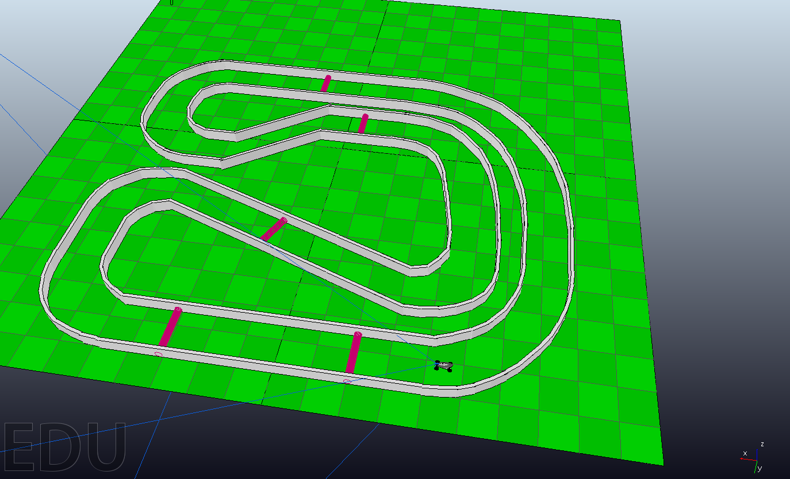

# need4stek



<!-- ABOUT THE PROJECT -->
## About The Project
Epitech project. Simulation of an autonomous car between the software CoppeliaSim and a C program.

<!-- REQUIREMENTS -->
## Requirements
* You need to download and extract [CoppeliaSim Edu V4.2.0](https://www.coppeliarobotics.com/downloads)
* GCC

<!-- GETTING STARTED -->
## Getting Started
After CoppeliaSim being extracted, execute ```./copelliaSim.sh``` in the folder, it will open the software

Open a track (.ttt) in CopelliaSim: `FILE->OPEN->need4stek->scene`

Open an other terminal, go to the need4stek folder, and execute ```make``` then ```./pipe.sh``` 
